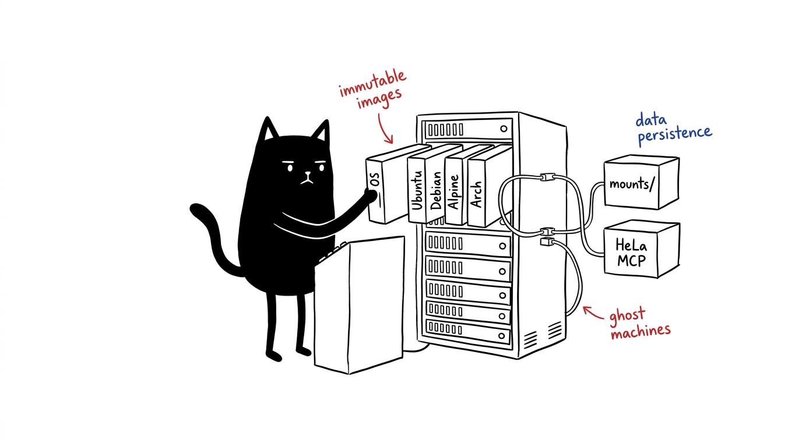

# Ghost Machines

Disposable, multi-engine Linux sandboxes and autonomous agent workstations orchestrated via Docker Compose.

Ghost Machines provides reproducible container environments with dynamic host user permissions, non-root execution, accurate resource virtualization through LXCFS, zero-trust remote access, and integration with the HeLa MCP Ecosystem.



---

## Table of Contents

- [Overview](#overview)
- [Infrastructure as Code (IaC) Architecture](#infrastructure-as-code-iac-architecture)
- [Prerequisites](#prerequisites)
- [Quick Start](#quick-start)
- [Operating System Engines](#operating-system-engines)
- [Deployment Modes & Resource Limits](#deployment-modes--resource-limits)
- [Multi-Tenant Workspace-as-a-Service (WaaS)](#multi-tenant-workspace-as-a-service-waas)
- [AI Harnesses & HeLa MCP Ecosystem](#ai-harnesses--hela-mcp-ecosystem)
  - [AI Harness Suite](#ai-harness-suite)
  - [HeLa Cellular MCP Stack](#hela-cellular-mcp-stack)
- [Toolchain & Included Packages](#toolchain--included-packages)
- [Security & Access Control](#security--access-control)
- [UI/UX & Shell Stack](#uiux--shell-stack)
- [State Snapshots & Recovery](#state-snapshots--recovery)
- [Cleanup](#cleanup)
- [Task Runner (Makefile) & Shell Shortcuts](#task-runner-makefile--shell-shortcuts)
- [Testing & Quality Assurance](#testing--quality-assurance)
- [License](#license)

> **New to containers?** See [docs/scripts.md](docs/scripts.md) — plain-English guide to each `*.sh`.
> Also: [docs/comparison-vs-vm.md](docs/comparison-vs-vm.md) (Ghost vs VM) · [docs/glossary.md](docs/glossary.md) (30-term glossary) · [ghost.glassgallery.my.id](https://ghost.glassgallery.my.id) (full web docs).

---

## Overview

Ghost Machines provides disposable, multi-engine Linux sandboxes and autonomous agent workstations orchestrated via Docker Compose.

> **Ghost vs regular VM?** See [docs/comparison-vs-vm.md](docs/comparison-vs-vm.md) — pros/cons, overhead, and decision matrix.

---

## Infrastructure as Code (IaC) Architecture

Ghost Machines is a practical implementation of **[Infrastructure as Code (IaC)](https://learn.microsoft.com/en-us/devops/deliver/what-is-infrastructure-as-code)** for development workstations and autonomous AI agent execution environments:

1. **Declarative Definitions:** Entire environments (OS kernels, runtimes, modern compilers, MCP daemons, user security, and network topology) are defined strictly in version-controlled code (`docker-compose.yml`, multi-engine Dockerfiles, and orchestration scripts).
2. **Idempotent & Automated Provisioning:** Any developer or CI pipeline can provision an identical, production-ready workstation with a single command (`./start.sh` or `make start`), eliminating configuration drift and "works on my machine" inconsistencies.
3. **Semi-Immutable Separation of Concerns:**
   - **Immutable Core (Images):** System packages, compilers, developer tools, runtimes, and MCP daemons are compiled into versioned, reproducible base images.
   - **Decoupled Mutable State (Mounts):** User home directories, project source code, and working files reside on host volume mounts under `mounts/`.
4. **Dynamic Permission Synchronization:** Container processes run under a dedicated `developer` account whose UID and GID dynamically match the host system, ensuring seamless read/write access to shared volumes without permission collisions.
5. **State Traceability & Disaster Recovery:** Smart snapshot management (`snapshot.sh` / `restore.sh`) with companion SHA-256 verification and atomic rollbacks allows instantaneous point-in-time recovery.

---

## Prerequisites

- **Host Operating System:** Linux, macOS (Docker Desktop / OrbStack), or Windows (WSL2).
- **Architecture:** x86_64 or aarch64 (ARM64).
- **Software:**
  - Docker Engine 20.10 or later.
  - Docker Compose v2.0 or later.
  - Optional: LXCFS on Linux hosts for accurate CPU/memory reporting.

---

## Quick Start

### 1. Clone the Repository

```bash
git clone https://github.com/1999AZZAR/ghost-machines.git
cd ghost-machines
```

### 2. Configure the Host (Optional for Linux)

Run the host setup script to install LXCFS and prepare systemd units:

```bash
make setup-host
# Or directly:
./setup-host.sh
```

### 3. Launch an Environment

Launch interactively:

```bash
make start
# Or directly:
./start.sh
```

Or pass flags directly for non-interactive startup:

```bash
# Launch Ubuntu engine in dual instance mode:
./start.sh -e ubuntu -m dual

# Launch Alpine engine on custom SSH port 2225 with image rebuild:
./start.sh --engine alpine --mode single --port 2225 --build

# Launch Debian engine in single instance mode:
./start.sh -e debian -m single
```

### 4. Connect via SSH

Once the container starts, connect immediately using standard SSH:

```bash
ssh -p 2223 developer@localhost
```

- **Default Username:** `developer`
- **Default Password:** `ghost` (for both SSH login and `sudo`)
- **Root Login:** `ssh -p 2223 root@localhost` (password: `ghost`)
- **Key Authentication:** If `~/.ssh/id_ed25519.pub` or `~/.ssh/id_rsa.pub` is present on your host, it is automatically mounted and authorized for passwordless access.


---

## Operating System Engines

Ghost Machines provides four base engines. Each image is configured with identical toolchains, editor setups, and MCP server configurations.

> **Prebuilt images (GHCR):** 4 separate packages published on release tags (`v*`) via `.github/workflows/publish.yml:1` — pull only the one you need:
>
> **Ubuntu** (recommended, PPA support) — ~1.38 GB amd64 / 1.21 GB arm64
> ```bash
> docker pull ghcr.io/1999azzar/ghost-machine-ubuntu:latest
> GHOST_IMAGE=ghcr.io/1999azzar/ghost-machine-ubuntu:latest ./start.sh -e ubuntu -m single
> ```
> **Debian** (slim, stable) — ~1.36 GB amd64 / 1.20 GB arm64
> ```bash
> docker pull ghcr.io/1999azzar/ghost-machine-debian:latest
> GHOST_IMAGE=ghcr.io/1999azzar/ghost-machine-debian:latest ./start.sh -e debian -m single
> ```
> **Alpine** (ultra-light, musl) — ~1.59 GB amd64 / 1.32 GB arm64
> ```bash
> docker pull ghcr.io/1999azzar/ghost-machine-alpine:latest
> GHOST_IMAGE=ghcr.io/1999azzar/ghost-machine-alpine:latest ./start.sh -e alpine -m single
> ```
> **Arch** (rolling release) — ~1.63 GB both arches
> ```bash
> docker pull ghcr.io/1999azzar/ghost-machine-arch:latest
> GHOST_IMAGE=ghcr.io/1999azzar/ghost-machine-arch:latest ./start.sh -e arch -m single
> ```

| Engine | Base Image | Package Manager | Intended Use |
| :--- | :--- | :--- | :--- |
| **Ubuntu** | `ubuntu:latest` | `apt-get` | Default development workstation with PPA support. |
| **Debian** | `debian:stable-slim` | `apt-get` | Minimal footprint and stable package base. |
| **Alpine** | `alpine:latest` | `apk` | Lightweight musl-based security sandbox. |
| **Arch Linux** | `archlinux:latest` | `pacman` | Rolling release with current package upstream. |

---

## Deployment Modes & Resource Limits

| Mode | Instances | CPU Limit | RAM Limit | Use Case |
| :--- | :---: | :---: | :---: | :--- |
| **Dual** | 2 | 1.0 core (each) | 8 GB (each) | Isolated multi-node setups and client-server workflows. |
| **Single** | 1 | 1.0 core | 8 GB | Standard standalone sandbox. |
| **Power** | 1 | 2.0 cores | 16 GB | Heavy builds and compute-intensive tasks. |
| **Half-Host** | 1 | 50% Host CPUs | 50% Host RAM | Dynamically scaled to half of host capacity. |

Container names:
- **Dual Mode:** `ghost-machine1`, `ghost-machine2`
- **Single / Power / Half Modes:** `ghost-machine-single`, `ghost-machine-power`, `ghost-machine-half`

### Real-World Resource Benchmarks

Ghost Machines is engineered for near-zero idle overhead with high performance under load:

| Operational State | Workload / Active Processes | CPU Usage | Memory Usage | Memory % (8 GB Sandbox) | Active PIDs |
| :--- | :--- | :---: | :---: | :---: | :---: |
| **Idle / Stale** | Container standby (`sshd` waiting for connections) | `0.00%` | `~73.5 MiB` | `0.90%` | `1` |
| **Active AI Agent** | `opencode` active session + all 7 HeLa MCP server daemons | `~1.99%` | `~1,002 MiB` | `12.23%` | `65` |

> [!TIP]
> Under full autonomous load with all 7 background MCP daemons actively communicating, the workstation consumes only **~1 GB**, leaving **~88% of memory headroom (~7 GB)** dedicated to heavy compilers (Rust, Go, Node, C++), test suites, and project builds.

---

## Multi-Tenant Workspace-as-a-Service (WaaS)

Ghost Machines implements a multi-tenant **[Workspace as a Service (WaaS)](https://en.wikipedia.org/wiki/Workspace_as_a_service)** and **[Cloud Development Environment (CDE)](https://learn.microsoft.com/en-us/azure/dev-box/overview-what-is-microsoft-dev-box)** architecture via `tenant.sh`. It enables engineering teams, educators, organizations, and VPS hosts to dynamically provision, scale, monitor, and vend isolated developer and autonomous AI agent workstations on a single high-performance machine:

### Quick Tenant Management Commands

**A. Using prebuilt images (fast, no build) — one per engine:**

Debian:
```bash
docker pull ghcr.io/1999azzar/ghost-machine-debian:latest
./tenant.sh add alice --engine debian --cpu 2.0 --mem 4G --port 2225
```
Ubuntu:
```bash
docker pull ghcr.io/1999azzar/ghost-machine-ubuntu:latest
./tenant.sh add bob --engine ubuntu --cpu 4.0 --mem 8G
```
Alpine:
```bash
docker pull ghcr.io/1999azzar/ghost-machine-alpine:latest
./tenant.sh add carol --engine alpine --port 2227
```
Arch:
```bash
docker pull ghcr.io/1999azzar/ghost-machine-arch:latest
./tenant.sh add dave --engine arch --port 2228
```

**B. Building locally (from Dockerfile):**

Debian (build):
```bash
./tenant.sh add alice --engine debian --build --cpu 2.0 --mem 4G --port 2225
```
Arch (build):
```bash
./tenant.sh add bob --engine arch --build --cpu 4.0 --mem 8G
```

**Common operations:**

```bash
# List all active tenants, engines, allocated ports, and storage size:
./tenant.sh list

# Real-time resource metrics across all tenant containers:
./tenant.sh stats

# Snapshot or restore an individual tenant's workspace:
./tenant.sh snapshot alice
./tenant.sh restore alice snapshots/snapshot_alice_20260830.tar.gz

# Delete a tenant with safe container teardown:
./tenant.sh delete bob -y
```

### Multi-Tenant Architecture & Isolation Guarantees

1. **Storage Isolation**: Each tenant's persistent workspace resides strictly in `./mounts/tenants/<tenant_id>/`. Non-overlapping volume mounts prevent cross-tenant data leakage.
2. **Resource Quotas**: Hard cgroup memory limits (e.g. `4G`), CPU quotas (e.g. `2.0`), and PID limits prevent noisy-neighbor performance degradation.
3. **Dedicated Endpoints**: Each workspace runs on its own SSH port or Cloudflare Tunnel endpoint with independent credentials and keys.
4. **Independent Lifecycle & Disaster Recovery**: Start, stop, restart, backup, and restore individual tenant workstations without disrupting other active users.

---

## AI Harnesses & HeLa MCP Ecosystem

### AI Harness Suite & RTK Token Optimization

Each Ghost Machine environment includes three dedicated CLI harnesses alongside the RTK token optimization runner:

- **[Antigravity CLI](https://github.com/google/antigravity)** (`agy` / `antigravity`): Agentic automation and multi-step reasoning.
- **[OpenCode CLI](https://github.com/opencode-ai/opencode)** (`opencode`): Codebase analysis and autonomous file patching.
- **[Kilo CLI](https://github.com/kilocode/kilo)** (`kilo` / `kilocode`): Interactive terminal coding assistant.
- **[RTK](https://github.com/rtk-ai/rtk)** (`rtk`): Token-optimized terminal execution runner.

#### RTK Universal Auto-Rewrite Hook

Every sandbox environment comes pre-configured with a universal `PreToolUse` hook (`~/.config/rtk/rtk-rewrite.sh`, `~/.gemini/config/hooks.json`, `~/.claude/settings.json`). Whenever an AI harness executes a terminal command (e.g. `git status`, `cargo test`, `pytest`), the hook automatically intercepts the raw command and proxies it through RTK, reducing LLM token consumption by **60%–90%** with zero manual configuration required.


### HeLa Cellular MCP Stack

All images build the **[HeLa MCP Ecosystem](https://github.com/1999AZZAR/hela-mcp-ecosystem)** using the `headless-server` profile (7 core headless servers). System wrapper scripts are linked into `/usr/local/bin`:

| Binary | Server ID | Description |
| :--- | :--- | :--- |
| `mcp-mitosis` | `hela-mitosis` | Dynamic tool discovery, prompt chaining, and sequential reasoning. |
| `mcp-genome` | `hela-genome` | SQLite knowledge graph (`memory.db`), milestone and state tracking. |
| `mcp-membrane` | `hela-membrane` | Sandboxed file system operations, recursive search, and patching. |
| `mcp-nucleus` | `hela-nucleus` | Command runner with timeouts and subshell isolation. |
| `mcp-ribosome` | `hela-ribosome` | Pseudo-terminal (PTY) multiplexer and regex event hooks. |
| `mcp-enzyme` | `hela-enzyme` | Research assistant combining Google Search and cached Wikipedia lookups. |
| `mcp-phenotype` | `hela-phenotype` | UI/UX token generator, OKLCH palettes, and Tailwind utility synthesis. |

Client configuration files are automatically generated and pre-configured for all three AI harnesses:
- **Antigravity CLI:** `~/.mcp/config.json`
- **OpenCode CLI:** `~/.config/opencode/config.json`
- **Kilo CLI:** `~/.config/kilo/config.json`

To mount a local clone of the ecosystem during container development, set `MCP_ECOSYSTEM_LOCAL_PATH` in `.env`:

```bash
MCP_ECOSYSTEM_LOCAL_PATH=/path/to/mcp-ecosystem
```

### Google Conductor Plugin Integration

**[Google Conductor](https://github.com/gemini-cli-extensions/conductor)** is built into `/opt/conductor` and globally available across all agent harnesses:

#### Installation Structure

```text
~/.agents/plugins/conductor/           # Permanent Git repository (linked to /opt/conductor)
├── plugin.json
├── rules/
│   └── conductor_antigravity.md       # Native UX & modal dialog rules
└── skills/                            # Live skill definitions, assets & scripts
    ├── conductor-setup
    ├── conductor-new-track
    ├── conductor-implement
    ├── conductor-status
    ├── conductor-revert
    └── conductor-review

~/.agents/skills/                      # Standard Agent SDK Global Skills
├── conductor-setup          -> ~/.agents/plugins/conductor/skills/conductor-setup
├── conductor-new-track      -> ~/.agents/plugins/conductor/skills/conductor-new-track
├── conductor-implement      -> ~/.agents/plugins/conductor/skills/conductor-implement
├── conductor-status         -> ~/.agents/plugins/conductor/skills/conductor-status
├── conductor-revert         -> ~/.agents/plugins/conductor/skills/conductor-revert
└── conductor-review         -> ~/.agents/plugins/conductor/skills/conductor-review

~/.gemini/config/plugins/
└── conductor                -> ~/.agents/plugins/conductor
```

#### Cross-Harness Compatibility

- **Antigravity / Jetski:** Loaded via `~/.gemini/config/plugins/conductor` + `ask_question` GUI modal UX adapter.
- **kilo-cli / OpenCode / Agent SDK:** Discovered automatically from global `~/.agents/skills/`.
- **Live Updates:** Run `git -C ~/.agents/plugins/conductor pull` inside any instance to pull upstream updates immediately.

#### Available Commands

| Command / Trigger | Description |
| :--- | :--- |
| `/conductor:conductor-setup` | Scaffolds project context (`product.md`, `tech-stack.md`, `workflow.md`, styleguides). |
| `/conductor:conductor-new-track` | Initializes a new feature or bug track (`spec.md` + `plan.md`). |
| `/conductor:conductor-implement` | Executes the active track's plan sequentially with TDD validation. |
| `/conductor:conductor-status` | Displays project progress and active tracks. |
| `/conductor:conductor-review` | Code quality review against plan and guidelines. |
| `/conductor:conductor-revert` | Git-aware rollback for logical tracks, phases, or tasks. |

---

## Toolchain & Included Packages

- **Runtimes & Compilers:**
  - **Python:** Astral [`uv`](https://github.com/astral-sh/uv) / `uvx` for package management, `pipx` for isolated CLI tools, and `python3-venv`.
  - **Rust:** [`rustup`](https://github.com/rust-lang/rustup) minimal profile (`cargo`, `rustc`).
  - **Go:** Go 1.24 toolchain (`/usr/local/go/bin`).
  - **JavaScript:** Node.js 22 LTS, [Bun](https://github.com/oven-sh/bun) runtime.
  - **C/C++:** `build-essential` / `base-devel`, `cmake`, `make`, `gdb`.
- **Editors & Git:**
  - [`helix`](https://github.com/helix-editor/helix) (configured with runtime assets), `micro`, [`lazygit`](https://github.com/jesseduffield/lazygit), `tmux`.
- **CLI Utilities:**
  - `bat`, `eza`, `zoxide`, `fd-find` (`fd`), `ripgrep` (`rg`), `jq`, `fzf`, `nnn`, `htop`, `btop`, [`fastfetch`](https://github.com/fastfetch-cli/fastfetch), `figlet`.

---

## Security & Access Control

1. **Default Credentials & Architecture as Code:**
   - Default User: `developer` (UID/GID auto-synced with host).
   - Default Password: `ghost` (for both `developer` and `root`).
   - Sudo Privileges: Standard sudo enabled for `developer` (enter `ghost` when prompted).

2. **Host UID/GID Synchronization:**
   On startup, `start.sh` extracts your host UID and GID and passes them as build/runtime parameters. The `developer` account inside the container matches these IDs, eliminating permission collisions on shared volume mounts.

3. **SSH Public Key Injection:**
   If a host public key (`~/.ssh/id_ed25519.pub`, `~/.ssh/id_rsa.pub`, etc.) is present, `start.sh` mounts it read-only. On container startup, `entrypoint.sh` installs the key into `.ssh/authorized_keys` with strict `0700`/`0600` permissions.

4. **Password Authentication:**
   Password authentication defaults to enabled (`developer:ghost`). To enforce key-only authentication, set in `.env`:
   ```bash
   SSH_PASSWORD_AUTH=false
   ```

5. **Cloudflare Zero-Trust Tunnel:**
   To expose the SSH port securely over a Cloudflare Tunnel without opening router ports, configure `TUNNEL_TOKEN` in `.env`.

---

## UI/UX & Shell Stack

Every Ghost Machine container automatically initializes a full developer shell environment out-of-the-box:

- **[Oh-My-Bash](https://github.com/ohmybash/oh-my-bash):** Pre-configured with themes, Git prompt, and directory helpers.
- **[Alias-Hub](https://github.com/1999AZZAR/alias-hub):** Categorized command aliases auto-loaded from `~/alias-hub` (including `cls` for clear, navigation, git, system tools).
- **[Fastfetch](https://github.com/fastfetch-cli/fastfetch) + [Neofetch-ASCII](https://github.com/1999AZZAR/neofetch_ascii):** Custom fastfetch configuration (`~/.config/fastfetch/config.jsonc`) with `fetch`, `rfetch` (random ASCII banner), and `ascii` (slideshow/banner via `figlet`).


---

## State Snapshots & Recovery

### Creating a Snapshot

The snapshot tool archives workspace mounts while automatically omitting ephemeral build caches (`node_modules/.cache`, `.npm/_cacache`, `.bun/install/cache`, `target/`, `__pycache__`, `.pytest_cache`, logs):

```bash
make snapshot
# Or with options:
./snapshot.sh -o snapshot_backup.tar.gz

# To capture complete directory without cache exclusions:
./snapshot.sh --all
```

Every snapshot creates two companion files:
- `<snapshot>.sha256`: SHA-256 checksum file.
- `<snapshot>.meta.json`: Metadata manifest containing host architecture, timestamp, file counts, and archive hash.

### Restoring a Snapshot

The restore script validates the SHA-256 checksum, creates an atomic pre-restore backup of existing mounts, and automatically rolls back if archive decompression fails:

```bash
make restore
# Or specify archive directly:
./restore.sh snapshot_backup.tar.gz

# Non-interactive mode (for automated workflows):
./restore.sh --force snapshot_backup.tar.gz
```

---

## Cleanup

Use the cleanup script to remove containers, networks, volumes, and images:

```bash
make clean

# Headless options:
./clean.sh -s          # Level 1 — stop containers/network
./clean.sh -v          # Level 2 — above + volumes
./clean.sh -a -y       # Level 3 — above + local *-template images
./clean.sh --nuke -y   # Level 4 — Level 3 + GHCR prebuilts + builder cache (full purge)
```

---

## Task Runner (Makefile) & Shell Shortcuts

### Makefile Targets

```text
build-all          Build all 4 OS engine images (Ubuntu, Debian, Alpine, Arch)
build-alpine       Build Alpine Linux template
build-arch         Build Arch Linux template
build-debian       Build Debian Slim template
build-ubuntu       Build Ubuntu master template
clean              Environment cleanup
help               Show available make targets
lint               Run static analysis & ShellCheck verification
restore            Restore workspace snapshot with integrity check
setup-host         Install host system dependencies (LXCFS, Docker)
snapshot           Create snapshot with cache exclusions & SHA-256
start              Launch interactive engine and deployment selector
test               Run automated test suite
```

### Shell Aliases

Source the included alias file to add shortcuts to your shell:

```bash
cat aliases.sh >> ~/.bashrc && source ~/.bashrc
```

- `ghost-status`: Display container status, port mappings, and resource allocations.
- `ghost-exec [container] [command]`: Execute a command in a running instance.
- `ghost-logs [container]`: View real-time container log output.
- `ghost-ssh [1|2|single|power|half]`: Connect directly over SSH.
- `start-ghost`: Open the interactive launcher.

---

## Testing & Quality Assurance

Run the test suite locally:

```bash
make test
```

The test runner validates:
1. `test_lint.sh`: ShellCheck verification, bash syntax check, and Docker compose configuration schema.
2. `test_m1_security.sh`: Host UID/GID sync, non-root user setup, and SSH key permission handling.
3. `test_m2_engine_optimization.sh`: Layer cleanup and multi-engine configuration parity.
4. `test_m3_cli_orchestration.sh`: CLI flag matrices, cleanup workflows, and host helper scripts.
5. `test_m4_snapshot_restore.sh`: Cache exclusions, SHA-256 verification, and atomic rollback recovery.
6. `test_m5_hela_mcp.sh`: HeLa MCP server binaries and isolated AI harness configurations.
7. `test_m5_toolchain.sh`: Python `uv`, `pipx`, and Rust toolchain installations.

All commits and pull requests are validated through GitHub Actions across Linux x86_64 and aarch64 runner matrices.

---

## License

This project is licensed under the MIT License. See [LICENSE](LICENSE) for details.
